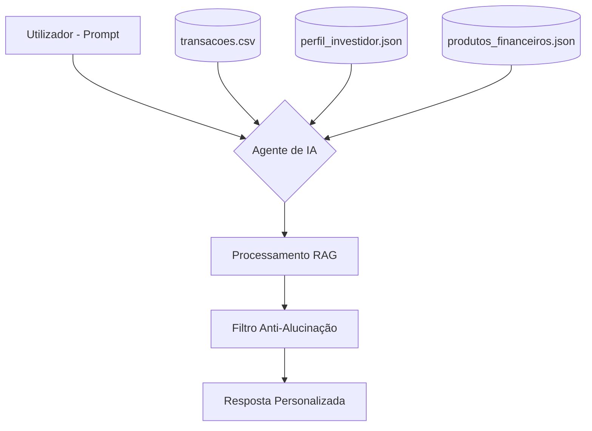

# 📑 Documentação do Agente Financeiro

## 1. Caso de Uso
O **Agente Financeiro Inteligente** resolve a fragmentação da informação financeira pessoal. Ele atua como uma camada de inteligência sobre dados brutos de transações, permitindo que o utilizador receba consultoria baseada em factos, e não em suposições generativas.

## 2. Arquitetura do Sistema (Fluxo de Dados)
Abaixo está a representação de como o agente processa a informação:

## 3. Persona e Tom de Voz
* **Persona:** Consultor financeiro sénior, analítico e focado em segurança.
* **Tom de Voz:** Profissional, direto, encorajador mas cauteloso com riscos.

## 4. Segurança e Confiabilidade
Para evitar alucinações, o sistema utiliza **Grounding** (Ancoragem). O modelo é instruído a ignorar conhecimentos externos ao contexto dos ficheiros fornecidos na pasta `data/`.
